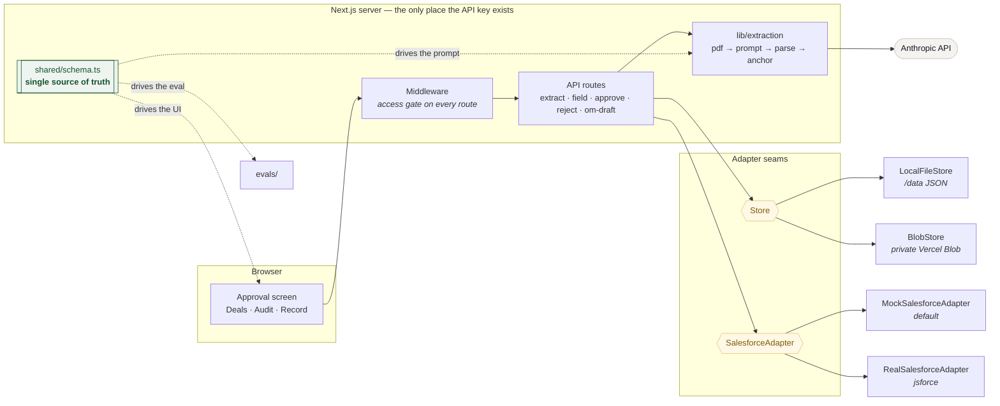

# Artificer

Artificer is a **tool, not a chatbot**: you drop in a net-lease deal document, it
extracts the structured deal data with a confidence grade and a verbatim source
citation for every field, and you review it side by side with the document.

Nothing reaches Salesforce until a human clicks approve. The AI drafts; the
person decides; the audit log records who decided what.

There is no chat interface anywhere in the product, by design.

---

## The workflow


The dashed lines are the audit trail: every step writes an append-only entry
recording who did what and when.

**The one rule the whole design serves:** the diamond in the middle is a person.
There is no path from a document to Salesforce that does not pass through it.

---

## What each step does

| Step | What happens | Why it is built that way |
| --- | --- | --- |
| **Upload** | PDF text is extracted and split into paragraphs with stable anchor ids. | Anchors, not pixel coordinates — a citation must land on the right passage every time, in every browser. |
| **Extract** | One model call per chunk, strict JSON, validated with zod. One repair retry on failure. | The model is asked for a contract, not for prose. Failing twice surfaces a clean error rather than half-parsed data. |
| **Verify** | Every quote is located in the document ourselves; the model's own anchor is treated as a hint. | A citation nobody checked is decoration. A quote that cannot be found loses its location *and* its high-confidence grade. |
| **Review** | Document left, fields right. Clicking a field scrolls to and highlights its source. | Checking a claim should cost one click. That is the whole product. |
| **Approve** | A modal states the objects and field counts about to be written, then writes. | Nobody should be able to say afterwards that they did not know what would happen. |
| **Draft** | An OM summary generated from the *approved record*, never the original document. | The draft can only contain values a person signed off on. |

---

### A note on naming

The product surface says **Artificer** throughout — the pipeline stage, the audit
entries, the provenance line on a reviewed deal. The underlying model is named
only where it has to be literally true: the `ANTHROPIC_MODEL` variable, the
engineering notes below, and `extractionMeta` on each stored deal, which keeps
the model and token counts for anyone debugging an extraction.

---

## Local setup

Requires Node 20+.

```bash
npm install
cp .env.example .env.local     # then fill in the gate values below
./scripts/set-api-key.sh       # prompts for ANTHROPIC_API_KEY (hidden input)
npm run seed                   # plants the sample deal so the app is never empty
npm run dev                    # http://localhost:3000
```

`set-api-key.sh` writes the key to `.env.local` and, if the Vercel CLI is
available, to the production environment too. It never puts the key on a command
line or in shell history.

Generate the two gate values:

```bash
# session secret
node -e "console.log(require('crypto').randomBytes(32).toString('hex'))"
# access code — anything memorable
```

The app opens on the access gate. Enter `ARTIFICER_ACCESS_CODE` to get in, then
follow the built-in walkthrough: it takes you from the sample deal through a
citation, a correction, an approval, the CRM record and an OM draft, ticking off
each step as you actually perform it.

### Useful scripts

| Command | What it does |
| --- | --- |
| `npm run dev` | Development server. |
| `npm test` | Vitest — 158 unit tests. |
| `npm run typecheck` | `tsc --noEmit`. |
| `npm run seed` | Plants the sample deal (idempotent; `-- --force` replaces). |
| `npm run reset-demo -- --yes` | Wipes a store and reseeds it to the intended first impression. |
| `npm run generate-samples` | Renders the three sample offering memos to PDF. |
| `npm run eval` | Scores extraction against ground truth. |
| `npm run check-store` | Exercises the live storage adapter end to end. |
| `npm run check-model` | Confirms `ANTHROPIC_MODEL` is reachable with the configured key. |
| `npm run inspect-pdf <file>` | Shows how a PDF is split into anchored paragraphs. |

---

## Environment variables

| Variable | Required | Purpose |
| --- | --- | --- |
| `ANTHROPIC_API_KEY` | yes | Server-side only. Never sent to the browser. |
| `ANTHROPIC_MODEL` | no | Defaults to `claude-sonnet-4-6`. |
| `ARTIFICER_ACCESS_CODE` | yes | The shared code on the gate page. |
| `ARTIFICER_SESSION_SECRET` | yes | HMAC key for the session cookie. 32+ bytes. |
| `BLOB_READ_WRITE_TOKEN` | prod | Present ⇒ the Vercel Blob store activates. |
| `ARTIFICER_STORE` | no | Force `local` or `blob`, overriding the above. |
| `ARTIFICER_DATA_DIR` | no | Where `LocalFileStore` writes. Defaults to `./data`. |
| `SF_LOGIN_URL`, `SF_USERNAME`, `SF_PASSWORD` | no | All three present ⇒ the real Salesforce adapter activates. |
| `SF_INSTANCE_URL` | no | Enables link-out to the record in the org. |

---

## Architecture



The load-bearing idea is `shared/schema.ts`. The extraction prompt, the approval
UI, the Salesforce field mapping and the eval comparison all read the same field
registry, so a field cannot exist in one and be missing from another — there is a
test that fails if they ever drift apart.

```
app/                    Next.js App Router — pages and API routes
  gate/                 access code page
  page.tsx              deals list + upload
  deals/[id]/           the approval screen
  records/[id]/         mock CRM record view
  audit/                audit timeline
  api/                  extract · gate · field · approve · reject · om-draft
components/             hand-styled React, no UI library
lib/
  extraction/           pdf → paragraphs → model → validated schema → anchors
  salesforce/           adapter interface, mock + real, field mapping
  store/                storage interface, local + blob
  audit.ts              append-only log
  session.ts            gate cookie (Web Crypto — runs in Edge and Node)
  walkthrough.ts        the guided first-run tour
shared/                 the deal schema — one source of truth
evals/                  sample generator, ground truth, scoring harness
docs/                   Salesforce object/field reference
scripts/                seed, reset, diagnostics
tests/                  vitest
```

Every model call happens in a server-side API route. The API key is never
present in a client bundle.

---

## The access gate

A single shared code, checked against `ARTIFICER_ACCESS_CODE`. A correct code
sets an httpOnly cookie signed with `ARTIFICER_SESSION_SECRET` (HMAC-SHA256,
12-hour expiry). Middleware protects every page and every API route except the
gate itself. Attempts are rate-limited to 8 per minute per IP.

**This is not authentication.** There are no user accounts and no per-user
permissions. It is a demonstration lock so that a public URL cannot burn API
tokens or expose demo deal data. Do not put real deal data behind it.

### Rotating the access code

```bash
vercel env rm ARTIFICER_ACCESS_CODE production
vercel env add ARTIFICER_ACCESS_CODE production   # paste the new code
vercel --prod                                     # redeploy to pick it up
```

Existing sessions stay valid until their cookie expires. To invalidate every
session immediately, rotate `ARTIFICER_SESSION_SECRET` as well — stored deals are
unaffected, since the storage namespace does not depend on it.

---

## Storage

One interface, two implementations, chosen by environment:

- **`LocalFileStore`** — JSON files under `/data` (gitignored). Used in development.
- **`BlobStore`** — the same JSON documents as objects in a **private** Vercel Blob
  store. Used in production, activated by the presence of `BLOB_READ_WRITE_TOKEN`.
  Private matters: the app's access gate would be beside the point if the deal
  data underneath it were readable by URL.

Nothing above the seam knows which is live, and the UI does not show which is —
it is not information a reviewer needs. To exercise the live adapter against the
real service:

```bash
ARTIFICER_STORE=blob npm run check-store
```

One honest limitation: the audit log is a single JSON document appended under an
in-process lock, so it assumes one writer at a time. That is fine for a review
tool with a handful of users and would need a real append-only store beyond that.

---

## Mock vs real Salesforce

Mock is the default and needs no configuration. It persists record sets through
the storage adapter and renders them at `/records/[id]` in a CRM-like record
view, so the demo has a real landing point. The header says **Demo CRM** so
nobody mistakes a rehearsal for a real write.

Setting `SF_LOGIN_URL`, `SF_USERNAME` and `SF_PASSWORD` switches the same write
to a live org via jsforce, and the header changes to **Live Salesforce**. See
**[docs/salesforce-schema.md](docs/salesforce-schema.md)** for the exact objects,
fields and picklist values to create, and for the external-ID field that makes
re-approval idempotent.

A partial SF configuration deliberately falls back to mock rather than failing at
the moment of approval.

### Idempotency

Approving computes a SHA-256 hash of the approved *business values* — excluding
confidence grades, citations and edit flags. Re-approving unchanged values finds
the same hash and updates the existing records instead of creating duplicates.
Correcting a value changes the hash and creates a new record set, which is the
intended behaviour; the audit log holds the trail between the two.

---

## Evals

Real deal documents cannot be committed to a repo, so the fixtures are generated
from source and reviewable as text:

```bash
npm run generate-samples   # renders 3 fictional offering memos to PDF
npm run eval               # scores extraction against evals/groundtruth/
```

The three samples are a dollar-store absolute-NNN in Ohio, a QSR ground lease in
Texas, and an industrial sale-leaseback in Arizona. Each is written to be
awkward in a way real documents are awkward: the Ohio memo contradicts itself
about building size, the Texas memo states outright that the tenant is unrated,
and the Arizona memo never mentions a guarantor at all.

The harness reports per-field match rates, overall accuracy, confidence
calibration, citation coverage, and the number the whole thing exists for:

> **Hallucinated values** — fields where ground truth is null and the model
> produced a value anyway.

That metric is weighted above accuracy on purpose. A missing value is visible in
the UI and gets triaged; an invented one looks exactly like a real one and is the
single thing most likely to reach the CRM unchallenged.

Runs are written to `evals/results/<timestamp>.json` — only the failures, so the
diff between runs is the useful artefact. Evals run locally only, never in the
deployed app.

Latest run: **100% accuracy (72/72 fields), 0 hallucinated, 100% citation coverage.**

---

## Tests

```bash
npm test          # vitest
npm run typecheck # tsc --noEmit
```

Covers the extraction response parser (fences, prose, malformed JSON, schema
violations), the schema registry (the prompt, UI and evals cannot drift apart),
paragraph segmentation, provenance anchoring, the DOMMatrix polyfill's maths, the
storage adapter contract, the Salesforce adapter contract and idempotency
hashing, the access gate, and the eval harness's own comparison logic.

Both the storage and Salesforce suites are written as *contract* tests run
against more than one implementation, so the interfaces are proven substitutable
rather than merely declared to be.

---

## Deployment

```bash
vercel link
vercel env add ANTHROPIC_API_KEY production
vercel env add ARTIFICER_ACCESS_CODE production
vercel env add ARTIFICER_SESSION_SECRET production
vercel blob create-store artificer-store --access private --yes
vercel --prod
ARTIFICER_STORE=blob npm run reset-demo -- --yes   # seed production
```

Two things that are easy to miss:

1. **Turn off Vercel's SSO deployment protection** (`vercel project protection
   disable <project> --sso`), or visitors hit a Vercel login instead of
   Artificer's own gate.
2. **Verify against a local production build, not `next dev`.** Several failures
   in this project only appeared once bundled — see below.

### Notes from getting this deployed

Worth recording, because all three were "works locally, fails deployed":

- **`pdf-parse` vendors a 2018 build of pdf.js** that throws `bad XRef entry`
  under Vercel's compiled Node runtime. Replaced with `pdfjs-dist`, which is the
  same library maintained, and which exposes the per-item text positions the
  paragraph segmentation needs anyway.
- **`@napi-rs/canvas` is an *optional* dependency of pdfjs**, so npm baked only
  the macOS binary into the lockfile and it could never load on Linux. pdf.js
  needs a `DOMMatrix` from it at module scope. Rather than ship 40 MB of native
  rendering code we never use, `lib/extraction/dom-matrix.ts` supplies a real 2D
  affine implementation — real, not stubbed, because a silently wrong matrix
  would corrupt text positions instead of failing loudly.
- **pdf.js loads its worker by runtime dynamic import**, which static file
  tracing cannot see, so `outputFileTracingIncludes` has to name it explicitly.
