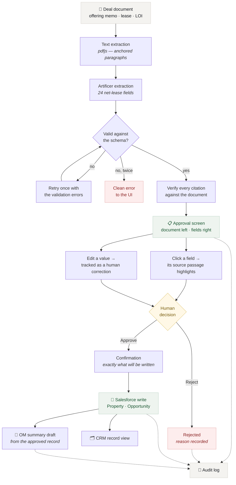
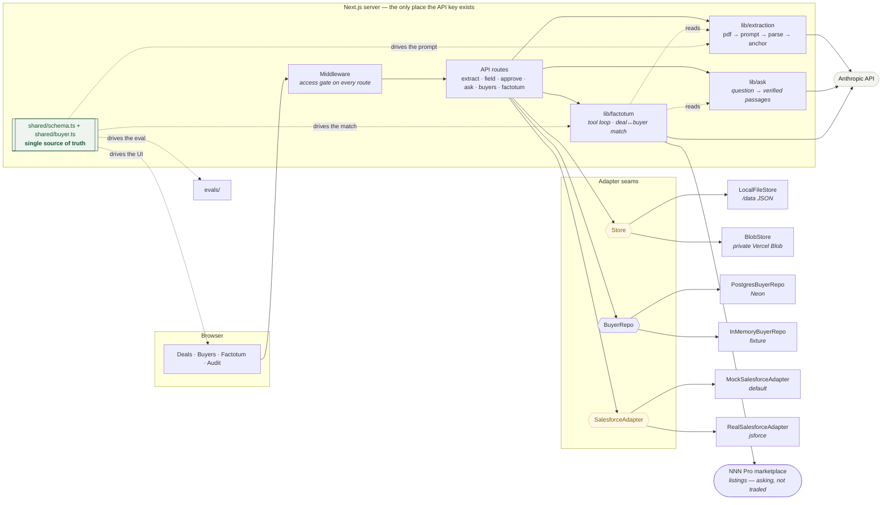

# Artificer

Artificer is net-lease deal software for a brokerage. It does four things:

- **Deal intake.** Drop in an offering memo, lease or LOI and it extracts 24
  structured fields, each with a confidence grade and the verbatim passage it
  came from, reviewed side by side with the document.
- **Ask the document.** Anything the 24 fields do not cover — a termination
  right, who carries roof and structure — answered with passages checked against
  the document rather than merely quoted.
- **A buyer pipeline.** Who is looking, what they will pay for, and how long
  they have; 1031 exchange buyers carry a 45-day identification clock that does
  not stop.
- **The Factotum.** A factotum does all kinds of work, which is the job — one
  place to ask across all of it, including the question the
  business actually turns on — *who do I call about this deal?* — plus what
  comparable property is currently listed at on the open market.

Nothing reaches Salesforce until a human clicks approve. The AI drafts; the
person decides; the audit log records who decided what. The Factotum can read
everything and change nothing, and that is structural rather than a rule it
follows — there is no write tool for it to reach.

> **A principle that changed.** This file used to say "there is no chat
> interface anywhere in the product, by design", and meant it. Two of the four
> capabilities above are now conversational, because some questions genuinely do
> not fit a form: *who should I call about this deal*, *what will they push back
> on*, *how does this price against the market*. What the original rule was
> protecting has survived intact — every factual claim is retrieved rather than
> recalled, every passage is verified before it is shown, and no assistant
> writes anything. The interface changed; the constraints did not.

It is also the **first domain service in a brokerage platform**, not a standalone
app — the seams it is built on are the ones the next tools will share. See
[Where this is going](#where-this-is-going).

---

## The workflow



The dashed lines are the audit trail: every step writes an append-only entry
recording who did what and when.

**The one rule the whole design serves:** the diamond in the middle is a person.
There is no path from a document to Salesforce that does not pass through it.

---

## What each step does

| Step | What happens | Why it is built that way |
| --- | --- | --- |
| **Upload** | PDF text is extracted and split into paragraphs with stable anchor ids. | Anchors, not pixel coordinates — a citation must land on the right passage every time, in every browser. |
| **Extract** | One model call per chunk, strict JSON, validated with zod. One repair retry on failure. | The model is asked for a contract, not for prose. Failing twice surfaces a clean error rather than half-parsed data. |
| **Verify** | Every quote is located in the document ourselves; the model's own anchor is treated as a hint. | A citation nobody checked is decoration. A quote that cannot be found loses its location *and* its high-confidence grade. |
| **Review** | Document left, fields right. Clicking a field scrolls to and highlights its source. | Checking a claim should cost one click. That is the whole product. |
| **Resolve** | A flagged field offers the competing value the document also states, with its own citation, plus edit / accept / confirm-absent. | A flag that only reports a problem is a dead end. Where the extraction already found the other figure, making the reviewer hunt for it is indefensible. |
| **Approve** | A modal states the objects and field counts about to be written, then writes. | Nobody should be able to say afterwards that they did not know what would happen. |
| **Draft** | An OM summary generated from the *approved record*, never the original document. | The draft can only contain values a person signed off on. |

---

### A note on naming

The product surface says **Artificer** throughout — the pipeline stage, the audit
entries, the provenance line on a reviewed deal. The underlying model is named
only where it has to be literally true: the `ANTHROPIC_MODEL` variable, the
engineering notes below, and `extractionMeta` on each stored deal, which keeps
the model and token counts for anyone debugging an extraction.

---

## Beyond deal intake

The workflow above is one of four capabilities. The other three arrived later and
share its machinery rather than duplicating it.

### Ask the document

The extraction answers 24 questions decided in advance. A box on the review
screen answers the rest — lease clauses, landlord obligations, what the memo says
about a market.

The point is that the citations are **checked**. Most "chat with your PDF"
features ask the model to cite and then trust the citation, which makes a
fabricated quote indistinguishable from a real one. Every passage here goes
through `resolveAnchor`, the same function the extraction pipeline uses, and
takes one of three paths:

| Outcome | What happens |
| --- | --- |
| Quote found in the paragraph it named | The citation stands. |
| Quote found somewhere else | The anchor is corrected — the quote is the evidence, the id was only bookkeeping. |
| Quote not in the document | Dropped, and its `[n]` marker stripped from the prose so it cannot point at nothing. |

If every passage offered for an answer was invented, the answer is returned but
labelled unsupported rather than rendered as fact.

The document sits behind a prompt-cache breakpoint and the question after it, so
a lease is paid for once rather than per question — measured at 37 input tokens
against 1,920 read from cache.

### The buyer pipeline

The book of buyers a deal gets matched against: the purchasing entity and the
contact, equity available, the cap rate band they will transact in, the asset
classes and states they buy in, and the weakest lease guaranty they will accept.

A buyer is defined in the deal schema's own terms — `shared/buyer.ts` imports
`PROPERTY_TYPES` and `GUARANTOR_TYPES` from `shared/schema.ts` rather than
restating them, which is what makes matching a comparison instead of a
translation.

A 1031 exchange buyer carries two statutory clocks: 45 days from their sale
closing to identify replacement property in writing, 180 to close. Both are
derived from that date and never stored — a stored deadline is one that can
disagree with the date it came from. A window that has closed is shown as closed
rather than hidden, because there is no extension in the statute and someone
needs to know why a buyer went quiet.

### The Factotum

Seven tools, all reads: the deal pipeline, every extracted field with its
confidence, the documents, the buyer book, deal-to-buyer matching, the audit log,
and live listings from the NNN Pro marketplace.

**The matching is ordinary code, not model judgement.** Five comparisons — cap
rate band, market, asset class, guaranty floor, and whether the equity covers the
cheque — run the same way every time and are covered by tests. A model eyeballing
sixty buyers against a numeric band is roughly right and occasionally, silently
wrong. The model decides *when* to ask and how to explain; it does not compute.

Three details the domain forced:

- A guaranty floor is a **ranking**, not equality: a buyer who accepts
  `franchisee` also accepts `corporate`. Backwards, this quietly offers
  franchisee deals to institutions.
- An all-cash buyer is held to the whole price, a financed one to a down payment.
  Holding everyone to the full number hides most of the market from every deal,
  so the reason string says "assumes 35% down" rather than passing an assumption
  off as a fact.
- **A test the document cannot answer passes rather than fails.** Excluding a
  buyer because the memo never stated the guarantor would narrow the list on the
  strength of a gap. The gap is reported instead.

Near misses come back alongside fits, with the single test each failed — a buyer
a quarter point outside the band is a phone call, not a rejection.

Every lookup is shown above the answer and can be opened. The assistant cannot
act, so there is no cost to exposing its working and every reason to: "eleven
buyers fit" is a claim, and the scoring behind it is something to check before
picking up the phone.

### Market data

`search_market_listings` reads the NNN Pro marketplace — the only view Artificer
has of anything outside itself.

Two things about that data are load-bearing. **Cap rate is not in the response**;
it is derived from NOI over price, as the marketplace's own front end does. And
**these are asking prices, not trades** — a seller asking 6.75% is evidence about
a market, not proof of one. That distinction is enforced in three places: the
type is `Listing` rather than `Comp`, the payload carries a `note` field, and the
prompt tells the model to write "currently listed at" rather than "trading at".

The endpoint is undocumented, so it is treated as weather: defensive parsing,
money arriving as decimal strings, state arriving as `US_FL` or `Florida` or `FL`
in the same column, an 8-second timeout, a 5-minute cache, and a failure that
degrades to "answer from what is in Artificer instead" rather than taking the
reply down. `SURMOUNT_API_URL` points it elsewhere if a real contract appears.

---

## Where this is going

**Artificer is the first domain service in a brokerage platform, not a standalone
app.** If more tools are coming — and they are — a monorepo is the better
architecture to commit to now, while there is one service in it and the cost of
the decision is near zero.

```
platform/
  apps/
    artificer/         deal intake — this
    nnnpro-web/        the marketplace frontend
    console/           internal broker tooling
  packages/
    domain/            the net-lease vocabulary — the load-bearing package
    salesforce/        one adapter, one field mapping, shared
    documents/         PDF → anchored paragraphs
    extraction/        LLM + provenance verification
    audit/             append-only log
    ui/                design system
  services/
    sync/              Salesforce → read replica
```

The package that justifies the whole structure is **`domain`**. Artificer already
proves the pattern in miniature: `shared/schema.ts` is a single field registry
that drives the extraction prompt, the approval UI, the Salesforce mapping and
the eval harness — with a test that fails if any of them drift apart. Promote
that to `@platform/domain` and the same definition drives the marketplace's
filters, the sync's column mapping, and whatever tool comes third. One answer to
"what is a net-lease deal", enforced by the compiler rather than by convention.

### What is already shaped for it

Not aspiration — these seams exist and are covered by contract tests run against
more than one implementation, which is what makes them safe to extract:

| Seam | Today | Extracts to |
| --- | --- | --- |
| `Store` | local files / Vercel Blob | `packages/storage` |
| `SalesforceAdapter` | mock / real jsforce | `packages/salesforce` |
| `shared/schema.ts` | one field registry | `packages/domain` |
| PDF → anchored paragraphs | `lib/extraction/pdf.ts` | `packages/documents` |
| Append-only audit | `lib/audit.ts` | `packages/audit` |

### What should not be extracted yet

`ui`. There is no second consumer, and a design system pulled out before one
exists is one app's internals wearing a costume. Extract it when the second app
needs it and the shape is known — not before.

More generally: the failure mode of a monorepo is packages that were never really
shared. The seams above earned their interfaces by having two implementations
each. Nothing else has.

### The open question

Whether **Surmount** — the API serving nnnpro.com — is in-house or a vendor.

- **In-house:** Artificer belongs inside that platform and shares its domain
  package; the sync becomes a first-class service in the same repo.
- **Vendor:** Artificer sits beside it, and Salesforce is the only contract
  between them — which is roughly the boundary it already respects.

That single fact changes the structure, and it is cheap to answer and expensive
to guess at. It is worth settling before any code moves.

### Candidate next services

Each reuses `domain`, `documents` and `audit` rather than reimplementing them:

- **Lease abstraction** — the same extraction pipeline pointed at executed leases
  rather than offering memos, where the provenance requirement is stricter still.
- **Listing composer** — the OM drafter, aimed at the marketplace. It already
  emits `{title, body}` highlights, which is exactly the shape of the
  `highlights[]` array on a listing. That was a guess when it was written and is
  now confirmed: a live listing carries
  `{"title": "Absolute NNN Corporate Guarantee", "body": "…", "number": 1}`.
  The drafter's output would need a `number` and nothing else.
- **Comp set / valuation** — reads the same Salesforce records rather than
  re-extracting them.

The monorepo above is a plan, not built. What exists today is the single app
described in the rest of this document — though "single app" now means four
capabilities rather than one workflow, and the Factotum has already made the case
for `domain` better than the argument did. It can answer "who do I call about
this deal" only because a buyer's `propertyTypes` and `minGuarantor` *are* the
deal schema's `PROPERTY_TYPES` and `GUARANTOR_TYPES`, imported rather than
restated. That is the whole thesis, working, inside one repository.

## Local setup

Requires Node 20+.

```bash
npm install
cp .env.example .env.local     # then fill in the gate values below
./scripts/set-api-key.sh       # prompts for ANTHROPIC_API_KEY (hidden input)
npm run seed                   # plants the sample deal so the app is never empty
npm run dev                    # http://localhost:3000
```

`set-api-key.sh` writes the key to `.env.local` and, if the Vercel CLI is
available, to the production environment too. It never puts the key on a command
line or in shell history.

Generate the two gate values:

```bash
# session secret
node -e "console.log(require('crypto').randomBytes(32).toString('hex'))"
# access code — anything memorable
```

The app opens on the access gate. Enter `ARTIFICER_ACCESS_CODE` to get in. The
**How it works** tab explains the pipeline, the confidence grades and the steps;
the built-in walkthrough then runs you through them: it takes you from the sample deal through a
citation, a correction, an approval, the CRM record and an OM draft, ticking off
each step as you actually perform it.

### Demo documents

The walkthrough runs on the seeded deal, which is already extracted. To show the
step before that — a document going in and structured data coming out — you need
a PDF to drop on the upload area. Three are committed under `evals/samples/`, so
a fresh clone is ready to demo with no extra step.

| File | Shows |
| --- | --- |
| `industrial-sale-leaseback-tempe-az.pdf` | **The one to demo.** No guarantor is named anywhere and the memo says outright that the tenant is unrated, so three fields come back `not_found`. The landlord keeps roof and structure, so the lease is `NN` and not the `absolute NNN` the phrasing invites. Remaining term is never stated and cannot be computed — that is the flagged field to resolve by hand. |
| `qsr-ground-lease-round-rock-tx.pdf` | The happy path. A tidy memo where nearly every field is stated outright and graded high. Useful first if you want the contrast before the Arizona one. |
| `dollar-general-mount-vernon-oh.pdf` | Already seeded as the sample deal — uploading it again only duplicates what the walkthrough covers. |

Each is fictional and watermarked *FICTIONAL SAMPLE* on every page, so it is safe
in front of an audience. The absences are the point: a field the model declines
to answer is the behaviour worth showing, because an invented one looks exactly
like a real one.

The PDFs are committed even though they are generated output, because a demo
that requires a build step before it can start is a demo that fails in front of
someone. `evals/sample-content.ts` remains the source of truth — generation is
pinned to a fixed timestamp and is byte-for-byte reproducible, so the samples
cannot quietly drift from it:

```bash
npm run generate-samples && git diff --exit-code evals/samples   # clean ⇒ in sync
```

### Useful scripts

| Command | What it does |
| --- | --- |
| `npm run dev` | Development server. |
| `npm test` | Vitest — 284 unit tests. |
| `npm run typecheck` | `tsc --noEmit`. |
| `npm run seed` | Plants the sample deal (idempotent; `-- --force` replaces). |
| `npm run seed-buyers` | Ensures the buyer table and seeds it **only if empty** — safe on every deploy, and what `build` runs. `-- --reseed` discards and reloads, which is also what refreshes the 1031 clocks. |
| `npm run reset-demo -- --yes` | Wipes a store and reseeds it to the intended first impression. |
| `npm run generate-samples` | Renders the three sample offering memos to PDF. |
| `npm run eval` | Scores extraction against ground truth. |
| `npm run check-store` | Exercises the live storage adapter end to end. |
| `npm run generate-sf-docs` | Regenerates `docs/salesforce-schema.md` from the mapping table. |
| `npm run check-model` | Confirms `ANTHROPIC_MODEL` is reachable with the configured key. |
| `npm run inspect-pdf <file>` | Shows how a PDF is split into anchored paragraphs. |

---

## Environment variables

| Variable | Required | Purpose |
| --- | --- | --- |
| `ANTHROPIC_API_KEY` | yes | Server-side only. Never sent to the browser. |
| `ANTHROPIC_MODEL` | no | Defaults to `claude-sonnet-4-6`. |
| `ARTIFICER_ACCESS_CODE` | yes | The shared code on the gate page. |
| `ARTIFICER_SESSION_SECRET` | yes | HMAC key for the session cookie. 32+ bytes. |
| `DATABASE_URL` | buyers | Postgres for the buyer pipeline. `POSTGRES_URL` (which the Vercel integration sets) is accepted too. Absent ⇒ an in-memory fixture, and the page says so. |
| `BUYER_PIPELINE_REPO` | no | Force `postgres` or `memory`, overriding the above. |
| `SURMOUNT_API_URL` | no | Points the market lookup at something other than `https://api.surmount.com`. |
| `BLOB_READ_WRITE_TOKEN` | prod | Present ⇒ the Vercel Blob store activates. |
| `ARTIFICER_STORE` | no | Force `local` or `blob`, overriding the above. |
| `ARTIFICER_DATA_DIR` | no | Where `LocalFileStore` writes. Defaults to `./data`. |
| `SF_LOGIN_URL`, `SF_USERNAME`, `SF_PASSWORD` | no | All three present ⇒ the real Salesforce adapter activates. |
| `SF_INSTANCE_URL` | no | Enables link-out to the record in the org. |

---

## Architecture



The load-bearing idea is `shared/schema.ts`. The extraction prompt, the approval
UI, the Salesforce field mapping and the eval comparison all read the same field
registry, so a field cannot exist in one and be missing from another — there is a
test that fails if they ever drift apart.

```
app/                    Next.js App Router — pages and API routes
  gate/                 access code page
  how-it-works/         the guide: pipeline, steps, grades, principles
  page.tsx              deals list + upload
  deals/[id]/           the approval screen
  records/[id]/         mock CRM record view
  audit/                audit timeline
  api/                  extract · gate · field · approve · reject · om-draft
components/             hand-styled React, no UI library
lib/
  extraction/           pdf → paragraphs → model → validated schema → anchors
  salesforce/           adapter interface, mock + real, field mapping
  store/                storage interface, local + blob
  audit.ts              append-only log
  session.ts            gate cookie (Web Crypto — runs in Edge and Node)
  walkthrough.ts        the guided first-run tour
shared/                 the deal schema — one source of truth
evals/                  sample generator, ground truth, scoring harness
docs/                   Salesforce object/field reference
scripts/                seed, reset, diagnostics
tests/                  vitest
```

Every model call happens in a server-side API route. The API key is never
present in a client bundle.

---

## The access gate

A single shared code, checked against `ARTIFICER_ACCESS_CODE`. A correct code
sets an httpOnly cookie signed with `ARTIFICER_SESSION_SECRET` (HMAC-SHA256,
12-hour expiry). Middleware protects every page and every API route except the
gate itself. Attempts are rate-limited to 8 per minute per IP.

**This is not authentication.** There are no user accounts and no per-user
permissions. It is a demonstration lock so that a public URL cannot burn API
tokens or expose demo deal data. Do not put real deal data behind it.

### What has to change before this holds anything real

Per-user authentication is the prerequisite, and it is a larger job than it
looks, because three things depend on the gate being the only boundary:

- **The audit log records a name the browser supplied.** `requireReviewerName()`
  reads it from `localStorage`, so "who approved this" is currently a claim
  rather than a fact. Real accounts turn the audit trail from a demonstration
  into evidence, which is most of its point.
- **Everyone through the gate sees everything** — every deal, every buyer's
  equity and contact details, the whole audit log. Commercially, a buyer's
  capital position is exactly the sort of thing that should not be visible
  firm-wide by default.
- **The Factotum lowers the cost of reading all of it.** It does not widen the
  boundary — it reaches nothing a signed-in visitor could not already open — but
  browsing sixty buyers and a document used to take effort and now takes one
  sentence. A shared code that leaks was always bad; it is worse when the leak
  comes with an assistant.

The shape of the fix is ordinary: real accounts, a role on each one, the reviewer
name taken from the session instead of the browser, and the buyer and deal
queries scoped to what that user is allowed to see. None of it is exotic. It is
simply not built, and the honest position is that this is a demonstration until
it is.

### Rotating the access code

```bash
vercel env rm ARTIFICER_ACCESS_CODE production
vercel env add ARTIFICER_ACCESS_CODE production   # paste the new code
vercel --prod                                     # redeploy to pick it up
```

Existing sessions stay valid until their cookie expires. To invalidate every
session immediately, rotate `ARTIFICER_SESSION_SECRET` as well — stored deals are
unaffected, since the storage namespace does not depend on it.

---

## Storage

Two stores, for two shapes of data.

**Deals, drafts and the audit log** are documents, and live in a JSON store —
one interface, two implementations, chosen by environment:

- **`LocalFileStore`** — JSON files under `/data` (gitignored). Used in development.
- **`BlobStore`** — the same JSON documents as objects in a **private** Vercel Blob
  store. Used in production, activated by the presence of `BLOB_READ_WRITE_TOKEN`.
  Private matters: the app's access gate would be beside the point if the deal
  data underneath it were readable by URL.

**Buyers are rows**, and live in Postgres (Neon), because the pipeline is a
filtered, sorted, paged query over structured criteria and that is what SQL is
for. The same seam applies: `PostgresBuyerRepo` in deployment, an in-memory
fixture when no connection string is set, and `BUYER_PIPELINE_REPO` to force
either. `npm run seed-buyers` creates the table and seeds it only when it is
empty — an unconditional reload would be idempotent in the sense of always
producing the same sixty rows, and would discard every pipeline decision made
since the last release.

Nothing above the seam knows which is live, and the UI does not show which is —
it is not information a reviewer needs. To exercise the live adapter against the
real service:

```bash
ARTIFICER_STORE=blob npm run check-store
```

One honest limitation: the audit log is a single JSON document appended under an
in-process lock, so it assumes one writer at a time. That is fine for a review
tool with a handful of users and would need a real append-only store beyond that.

---

## Why the Salesforce schema looks the way it does

The object and field names are not invented. They were derived from the public
API behind **nnnpro.com** (`api.surmount.com/sf-opportunities`), which serves a
Salesforce replica: every record carries a `salesforce_id`, and an `sf_property`
is nested inside each opportunity.

That matters more than a naming detail. **The customer-facing marketplace reads
from Salesforce.** So writing to Salesforce is not a stand-in for the real
integration — it *is* the integration, and the approval gate sits at the last
point before a figure becomes publicly visible to investors. A wrong cap rate in
an internal CRM is an embarrassment; on a public listing it is a different kind
of problem.

Two consequences worth knowing:

- **Cap rate and price per SF are extracted but not written.** The listing derives
  both from list price and NOI, and writing an independently extracted rate would
  create a second source of truth that can disagree with the arithmetic. They are
  still cited and reviewed — a mismatch is worth catching — just not written.
- **`Concept__c` is picklist-backed** and drives the marketplace's Concept filter,
  so a free-text tenant name would produce a listing no filter can find.
  Validating it against the live picklist is the highest-value next change.

`docs/salesforce-schema.md` is **generated** from `lib/salesforce/mapping.ts`
(`npm run generate-sf-docs`) so it cannot drift from what the adapter sends. Every
field records whether its name was observed, is a standard Salesforce field, or is
proposed by Artificer and would need creating in the org.

## Mock vs real Salesforce

Mock is the default and needs no configuration. It persists record sets through
the storage adapter and renders them at `/records/[id]` in a CRM-like record
view, so the demo has a real landing point. The header says **Demo CRM** so
nobody mistakes a rehearsal for a real write.

Setting `SF_LOGIN_URL`, `SF_USERNAME` and `SF_PASSWORD` switches the same write
to a live org via jsforce, and the header changes to **Live Salesforce**. See
**[docs/salesforce-schema.md](docs/salesforce-schema.md)** for the exact objects,
fields and picklist values to create, and for the external-ID field that makes
re-approval idempotent.

A partial SF configuration deliberately falls back to mock rather than failing at
the moment of approval.

### Idempotency

Approving computes a SHA-256 hash of the approved *business values* — excluding
confidence grades, citations and edit flags. Re-approving unchanged values finds
the same hash and updates the existing records instead of creating duplicates.
Correcting a value changes the hash and creates a new record set, which is the
intended behaviour; the audit log holds the trail between the two.

---

## Evals

Real deal documents cannot be committed to a repo, so the fixtures are generated
from source and reviewable as text:

```bash
npm run generate-samples   # renders 3 fictional offering memos to PDF
npm run eval               # scores extraction against evals/groundtruth/
```

The three samples are a dollar-store absolute-NNN in Ohio, a QSR ground lease in
Texas, and an industrial sale-leaseback in Arizona. Each is written to be
awkward in a way real documents are awkward: the Ohio memo contradicts itself
about building size, the Texas memo states outright that the tenant is unrated,
and the Arizona memo never mentions a guarantor at all.

The harness reports per-field match rates, overall accuracy, confidence
calibration, citation coverage, and the number the whole thing exists for:

> **Hallucinated values** — fields where ground truth is null and the model
> produced a value anyway.

That metric is weighted above accuracy on purpose. A missing value is visible in
the UI and gets triaged; an invented one looks exactly like a real one and is the
single thing most likely to reach the CRM unchallenged.

Runs are written to `evals/results/<timestamp>.json` — only the failures, so the
diff between runs is the useful artefact. Evals run locally only, never in the
deployed app.

Latest run: **100% accuracy (72/72 fields), 0 hallucinated, 100% citation coverage.**

---

## Tests

```bash
npm test          # vitest
npm run typecheck # tsc --noEmit
```

Covers the extraction response parser (fences, prose, malformed JSON, schema
violations), the schema registry (the prompt, UI and evals cannot drift apart),
paragraph segmentation, provenance anchoring, the DOMMatrix polyfill's maths, the
storage adapter contract, the Salesforce adapter contract and idempotency
hashing, the access gate, and the eval harness's own comparison logic.

Both the storage and Salesforce suites are written as *contract* tests run
against more than one implementation, so the interfaces are proven substitutable
rather than merely declared to be.

The later features brought their own, and several are worth naming because they
exist to stop a specific mistake recurring:

- **Citation verification** is tested against what happens when the model is
  wrong, not when it is right: a fabricated quote, a real quote filed under the
  wrong paragraph, an answer mixing both, and a quote that appears only in the
  *question* rather than the document.
- **The 1031 clock** covers month boundaries and leap years, and asserts that a
  passed window sorts and filters as passed rather than as urgent.
- **The buyer match** pins the guaranty ranking (a `franchisee` floor accepts
  `corporate`, not the reverse), the cash-versus-financed capital test, and that
  a fact the document never stated passes rather than excludes.
- **The market client** is tested against the endpoint misbehaving — a payload
  that changed shape, money as decimal strings, an outage — and against the
  query pattern that once silently lost a third of the matches.
- **The fixture** asserts its own anchors are unique, after a generated contact
  name appeared to represent three unrelated firms.

---

## Deployment

```bash
vercel link
vercel env add ANTHROPIC_API_KEY production
vercel env add ARTIFICER_ACCESS_CODE production
vercel env add ARTIFICER_SESSION_SECRET production
vercel blob create-store artificer-store --access private --yes
vercel --prod
ARTIFICER_STORE=blob npm run reset-demo -- --yes   # seed production
```

Two things that are easy to miss:

1. **Turn off Vercel's SSO deployment protection** (`vercel project protection
   disable <project> --sso`), or visitors hit a Vercel login instead of
   Artificer's own gate.
2. **Verify against a local production build, not `next dev`.** Several failures
   in this project only appeared once bundled — see below.

### Notes from getting this deployed

Worth recording, because all three were "works locally, fails deployed":

- **`pdf-parse` vendors a 2018 build of pdf.js** that throws `bad XRef entry`
  under Vercel's compiled Node runtime. Replaced with `pdfjs-dist`, which is the
  same library maintained, and which exposes the per-item text positions the
  paragraph segmentation needs anyway.
- **`@napi-rs/canvas` is an *optional* dependency of pdfjs**, so npm baked only
  the macOS binary into the lockfile and it could never load on Linux. pdf.js
  needs a `DOMMatrix` from it at module scope. Rather than ship 40 MB of native
  rendering code we never use, `lib/extraction/dom-matrix.ts` supplies a real 2D
  affine implementation — real, not stubbed, because a silently wrong matrix
  would corrupt text positions instead of failing loudly.
- **pdf.js loads its worker by runtime dynamic import**, which static file
  tracing cannot see, so `outputFileTracingIncludes` has to name it explicitly.

Note: covenant-4395
